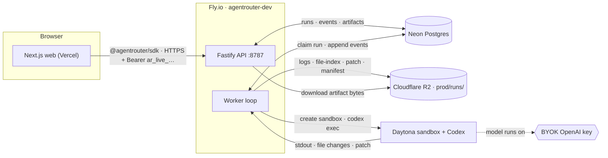
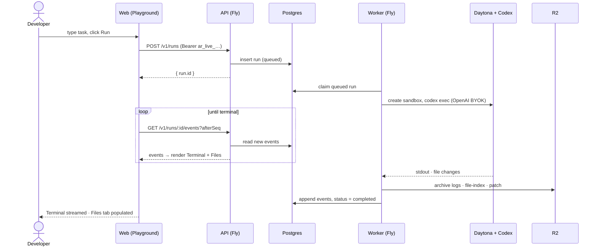
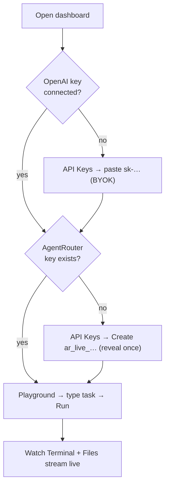
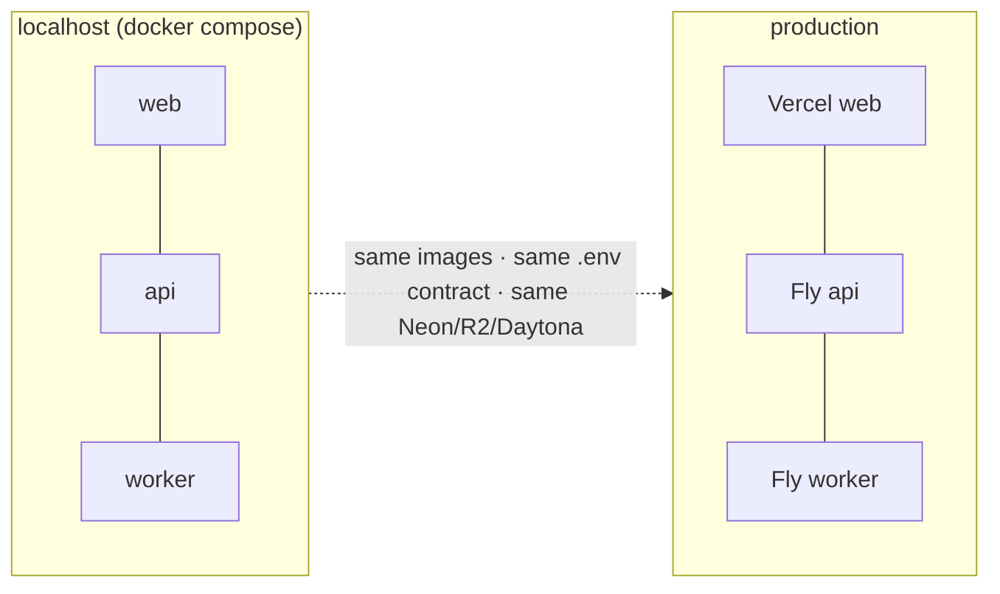

# AgentRouter Playground — Build Plan & Design

**Status:** proposed · **Date:** 2026-06-01 · **Scope:** two pages — **Playground** + **API Keys**
**Mockup:** [`playground.html`](./playground.html) (clickable, design-system-accurate)

---

## 1. Where this sits — the backend is already in production

The runtime is **deployed**: API + worker run on **Fly.io** (`agentrouter-dev`, region `sjc`) via Docker + GitHub Actions CI/CD. Managed backing services are live: **Neon** (Postgres), **Cloudflare R2** (`prod/runs/`), **Daytona** (sandboxes). The missing piece is the **web app** — these two pages.

| Layer | State | Host |
|---|---|---|
| Fastify **API** (`/v1/runs…`) | ✅ live | Fly.io (`web` process, :8787) |
| **Worker** (claims runs, drives Daytona+Codex, archives to R2) | ✅ live | Fly.io (`worker` process) |
| Postgres / R2 / Daytona | ✅ live | Neon / Cloudflare / Daytona |
| **Web app** (Playground + API Keys) | 🔨 to build | Vercel (Next.js) |

---

## 2. System architecture

---

## 3. Playground run — end-to-end sequence

---

## 4. User flow

---

## 5. Page specs

### 5.1 Playground (default route)
Split view — **chat (left)** + **the computer (right)**.
- **Chat:** task in → agent turns (reasoning / tool) → final summary. A **"Running on your OpenAI key"** chip (BYOK). Composer at the bottom.
- **The computer:** a window (traffic-lights + sandbox title + status pill) with **Terminal · Files** tabs.
  - *Terminal* ← live `provider.stdout/stderr` events from `GET /v1/runs/:id/events` (or `/stream`).
  - *Files* ← the `workspace_file_index` artifact (what the agent created/changed, A/M/D status).
- Wired to the **real SDK** against the live API. No Diff tab (this surface presents the API, not code review).

### 5.2 API Keys
Two distinct credentials:
- **Provider key (BYOK):** connect *your* OpenAI `sk-…` — encrypted at rest, used per run. *"The credential that actually runs your agents."*
- **AgentRouter keys (`ar_live_…`):** authenticate your app → AgentRouter. Table + **create → reveal-once** + scopes + revoke.

---

## 6. Real today vs to-build

| Capability | Backend today | To wire/build |
|---|---|---|
| Create + stream a run, list files | ✅ `/v1/runs` + `/events` + `/artifacts` | wire Next.js → SDK |
| Playground live terminal/files | ✅ events + `workspace_file_index` | render from real data |
| BYOK OpenAI key per business | ⚠️ single server-side key today | store encrypted + pass per-run |
| AgentRouter keys table | ⚠️ single static bearer token | keys service (DB + scopes + revoke) |
| Multi-turn chat | ❌ one-shot run today | persistent sandbox + Codex resume |

---

## 7. Deploy & local == prod parity (the hard requirement)

- **Same Docker image** runs locally (`docker compose`) and on Fly — no drift.
- **12-factor:** every endpoint/key/secret comes from env; nothing hardcodes `localhost`.
- **Same managed services** in both: your Neon, R2, Daytona via `.env`.
- Web → **Vercel**; API + worker → **Fly.io** (already). Deploy = swap env values, same code path.

---

## 8. Open items to confirm (then I lock it and the team builds)

1. **Tenancy:** single-tenant v1 (one workspace — real keys/BYOK/runs, no signup) with a multi-tenant-ready schema? Or signup/login in the first cut?
2. **Multi-turn vs one-shot v1:** one-shot ships immediately; true multi-turn is a backend lift (persistent sandbox + session resume).
3. **Keys + BYOK realness for v1:** wire BYOK + a real keys service now, or ship the live Playground first and layer keys/BYOK right after?

> Build order recommendation: **Playground live (one-shot) → API Keys (BYOK + real keys) → multi-turn.** Each step deployable on its own.
