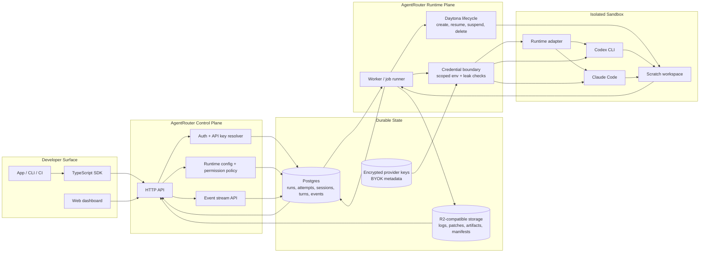

# AgentRouter

Self-hosted control plane for running Codex and Claude Code inside product
workflows.

AgentRouter gives you the runtime around agent runs: sandboxing, long-running
jobs, streaming events, persisted run state, artifacts, patches, retries,
provider-key isolation, and a TypeScript SDK. Bring your own model keys and run
Codex or Claude Code from your app, CLI, dashboard, CI job, or internal tool
without rebuilding the execution layer.


> AgentRouter is alpha. The core runtime, SDK, API, worker, and database paths
> are tested, but the setup still expects developers who are comfortable with
> Postgres, sandbox providers, and provider API keys.

## Why AgentRouter

Codex and Claude Code are strong general-purpose agents. They can explore a
repo, edit files, run commands, manage context, recover from intermediate
states, and keep working across multi-step tasks.

The problem starts when that agent becomes part of a product workflow. Product
teams need a control plane around the run: where it executes, what state is
stored, how progress streams back to users, which artifacts are produced, when
the run can be cancelled or resumed, and how provider keys and sandbox
permissions stay isolated.

AgentRouter is that runtime layer. You define the product workflow, such as:

- PR review agents that inspect a diff, run tests, and produce comments.
- Bug reproduction agents that investigate a failing case in a sandbox.
- Test-fixing agents that generate patches and archive changed files.
- Dependency upgrade, release note, and repo documentation agents.
- Internal tools that expose Codex or Claude Code as a controlled API.
- CI workflows that run an agent and collect logs/artifacts.

AgentRouter handles the execution surface around those workflows: isolated
Daytona sandboxes, long-running jobs, streaming progress, conversation state,
permissions, provider keys, logs, generated files, patches, artifacts, and
resume behavior. The same API and TypeScript SDK can run Codex or Claude Code
behind one interface.

AgentRouter lets you focus on the agent your users need, not the runtime
infrastructure required to operate it.

## What AgentRouter Handles Today

- HTTP API and TypeScript SDK for creating, streaming, continuing, and
  cancelling agent runs.
- Worker loop that claims queued runs and executes them in isolated Daytona
  sandboxes.
- Runtime adapters for Codex CLI and Claude Code.
- Streaming observable progress events without exposing hidden model
  chain-of-thought.
- Durable run, attempt, session, turn, and event state in Postgres.
- R2-compatible artifact storage for logs, patches, generated files, file
  indexes, and session manifests.
- Credential boundary that keeps provider keys server-side and scoped to the
  provider process.
- Run-id based continuation for multi-turn workflows.

## Roadmap From Launch Feedback

The current runtime already records events and artifacts, but launch feedback
made the next product direction clearer: production agent runs need to be safe,
inspectable, resumable, and controllable.

- [Queryable run record](https://github.com/perixtar/AgentRouter/issues/3):
  make the run record the source of truth for current state, available actions,
  artifacts, decisions, and terminal outcomes.
- [First-class approval boundaries](https://github.com/perixtar/AgentRouter/issues/4):
  distinguish what the agent proposed, what policy allowed or blocked, what a
  human approved or denied, and what the runtime actually executed.
- [Stuck/no-progress detection](https://github.com/perixtar/AgentRouter/issues/2):
  surface repeated commands, repeated edits with no meaningful diff, and long
  output periods without state transitions.

These are active product-direction issues, not fully shipped features yet.

## Architecture



The API owns request validation, auth, run creation, idempotency, and streaming.
The worker owns everything after a run is claimed: sandbox lifecycle, runtime
launch, credential scoping, event normalization, artifact capture, and cleanup.
Postgres is the system of record; R2 stores large immutable run artifacts.

This repository contains the self-hosted runtime. Hosted account management,
dashboard, billing, Cloud API keys, and hosted BYOK storage are intentionally
not part of this repository.

## Quickstart

### Prerequisites

- Node.js 24
- pnpm 10
- Postgres
- Daytona API key
- Cloudflare R2-compatible bucket
- `OPENAI_API_KEY` or `CODEX_API_KEY` for Codex
- `ANTHROPIC_API_KEY` for Claude Code

Local unit/integration tests can use placeholder provider and R2 values. Live
sandbox runs require real Daytona, provider, Postgres, and R2 credentials.

### Install

```sh
pnpm install
```

### Configure

```sh
cp .env.example .env
```

Fill in the required values:

```sh
# Private bearer token for your self-hosted AgentRouter API.
# This is not an OpenAI/Anthropic provider key; choose any random value.
AGENTROUTER_API_KEY=ar_local_dev_secret
DATABASE_URL=postgres://...
DAYTONA_API_KEY=...
OPENAI_API_KEY=...
ANTHROPIC_API_KEY=...
R2_ACCOUNT_ID=...
R2_ACCESS_KEY_ID=...
R2_SECRET_ACCESS_KEY=...
R2_BUCKET=...
R2_ENDPOINT=https://<account-id>.r2.cloudflarestorage.com
```

### Start The Runtime

```sh
pnpm dev
```

This starts:

- API server on `http://127.0.0.1:8787`
- Worker process that claims queued runs and starts sandboxes

Run them separately when debugging:

```sh
pnpm api:dev
pnpm worker:dev
```

### Create A Run

```sh
curl -sS http://127.0.0.1:8787/v1/runs \
  -H "Authorization: Bearer $AGENTROUTER_API_KEY" \
  -H "Content-Type: application/json" \
  -d '{
    "task": "Reply exactly AR_CODEX_OK",
    "runtime": {
      "kind": "codex",
      "mode": "default",
      "model": "gpt-4o"
    }
  }'
```

If you are not running the worker loop, process one queued run manually:

```sh
pnpm worker:run-once
```

## TypeScript SDK

Install the SDK from npm:

```sh
npm install @agentrouterhq/sdk
```

```ts
import { agentrouter, codex, runAgent } from "@agentrouterhq/sdk";

const client = agentrouter({
  baseUrl: "http://127.0.0.1:8787",
  apiKey: process.env.AGENTROUTER_API_KEY!
});

const result = await runAgent({
  client,
  task: "Inspect this repo and summarize the test strategy.",
  runtime: codex({ mode: "default", model: "gpt-4o" })
});

console.log(result.text);
```

Run the SDK example:

```sh
pnpm example:quickstart:run
```

## SDK Event Model

`streamAgent` exposes two streaming surfaces:

- `stream.events` gives raw persisted run events for audit and replay.
- `stream.fullStream` gives app-friendly parts for progress, approvals,
  execution, no-progress warnings, messages, final text, errors, and terminal
  state.

The control-plane event chain exists so products can show more than logs:

| Raw event | SDK part | Purpose |
| --- | --- | --- |
| `action.proposed` | `action` | Defines the exact runtime action AgentRouter may execute. |
| `policy.evaluated` | `progress` | Records whether policy allowed, blocked, or required approval for that action. |
| `approval.requested` | `approval_request` | Pauses a manual run until the app approves or denies the action digest. |
| `approval.decided` | `approval_decision` | Records the immutable approve/deny decision. |
| `execution.started` | `execution` | Shows that the approved action started in the sandbox. |
| `execution.completed` / `execution.failed` | `execution` | Shows whether sandbox execution finished or failed. |
| `agent.no_progress` | `no_progress` | Surfaces suspected stuck loops: repeated failed commands, repeated edits, or long output without state transitions. |

Manual approval:

```ts
const stream = await streamAgent({
  client,
  task: "Run tests and summarize failures.",
  runtime: codex({ mode: "full_access" }),
  approvalMode: "manual"
});

for await (const part of stream.fullStream) {
  if (part.type === "approval_request") {
    await client.approveRunAction({
      runId: stream.run.id,
      actionId: part.actionId,
      actionDigest: part.actionDigest
    });
  }
}
```

Run the approval example:

```sh
pnpm example:recipe:approval-events
```

## Multi-Turn Runs

A run id can become the conversation handle. Start a run, then continue it by
posting a follow-up message to the same run id.

The public SDK uses run ids as the only conversation handle. Use
`streamAgent({ continueRun, message })` for streamed follow-up turns, or
`runAgent({ continueRun, message })` when you only need the final result.
There is no separate public session API.

Mental model:

```txt
conversationId  stable id for the whole conversation; this is the first run id
runId           id for one specific turn; each follow-up turn gets a new run id
```

```ts
import { agentrouter, codex, streamAgent } from "@agentrouterhq/sdk";

const client = agentrouter({
  baseUrl: "http://127.0.0.1:8787",
  apiKey: process.env.AGENTROUTER_API_KEY!
});

const turn1 = await streamAgent({
  client,
  task: "Create src/fib.ts with a fib(n) function.",
  runtime: codex({ mode: "full_access" })
});

// After the first run completes within the continuation grace window:
const firstResult = await turn1.finalResult;
const turn2 = await streamAgent({
  client,
  continueRun: firstResult.id,
  message: "Now add tests for fib(n)."
});

for await (const part of turn2.fullStream) {
  if (part.type === "progress") console.log(part.text);
  if (part.type === "text") process.stdout.write(part.text);
}
```

See [packages/sdk-typescript/README.md](packages/sdk-typescript/README.md) for
the full SDK surface.

## Examples

Quickstarts:

```sh
pnpm example:quickstart:minimal
pnpm example:quickstart:run
pnpm example:quickstart:stream
pnpm example:quickstart:claude
```

Recipes:

```sh
pnpm example:recipe:continue
pnpm example:recipe:artifacts
pnpm example:recipe:runtime-modes
pnpm example:recipe:low-level
pnpm example:recipe:errors
pnpm example:recipe:tool-boundary
```

The most complete end-to-end demo is:

```sh
pnpm example:recipe:artifacts
```

It runs a coding-agent scenario in a Daytona sandbox, streams progress,
restores the final session, downloads R2 artifacts, verifies the workspace file
index, and prints generated files from the workspace patch.

## Documentation

- [Self-hosting guide](docs/self-hosting.md)
- [Examples guide](examples/README.md)
- [TypeScript SDK guide](packages/sdk-typescript/README.md)
- [Security policy](SECURITY.md)
- [Contributing guide](CONTRIBUTING.md)

## Security Model

AgentRouter is designed around a narrow trust boundary:

- Provider keys are read by the worker and passed only to the provider process.
- Provider keys are not copied into the general sandbox environment.
- Agent commands run inside sandboxed Daytona environments.
- API access is protected by a self-hosted bearer token: `AGENTROUTER_API_KEY`.
- Run events and artifacts are persisted for inspection and replay.
- Credential-boundary tests check that canary secrets do not leak into logs,
  events, or archived artifacts.

This repository does not store hosted customer provider keys. Self-hosted users
keep provider credentials in their own environment.

## Packages

| Package | Purpose |
| --- | --- |
| `@agentrouterhq/sdk` | TypeScript client and helpers for creating, streaming, and continuing runs |
| `@agentrouter/api` | Fastify API server for runs, events, artifacts, and sessions |
| `@agentrouter/worker` | Worker loop that claims runs and executes them in sandboxes |
| `@agentrouter/core` | Shared run state, event normalization, and provider output parsing |
| `@agentrouter/db` | Postgres schema and repository helpers |
| `@agentrouter/runtime-codex-cli` | Codex CLI runtime adapter |
| `@agentrouter/runtime-claude-code` | Claude Code runtime adapter |
| `@agentrouter/sandbox-daytona` | Daytona sandbox driver |
| `@agentrouter/artifacts-r2` | R2 artifact storage |
| `@agentrouter/openapi` | OpenAPI contract |

## Development

Local checks:

```sh
pnpm typecheck
pnpm test:ci
```

Focused test suites:

```sh
pnpm test:unit
pnpm test:api
pnpm test:sdk
pnpm test:db
pnpm test:worker
```

External service tests:

```sh
pnpm test:r2
pnpm test:daytona
pnpm test:providers:smoke
pnpm test:e2e:codex
pnpm test:e2e:claude
```

External tests require real credentials and may create cloud resources.

## Deployment

Run the self-hosted runtime as two processes:

```sh
pnpm api:start
pnpm worker:start
```

The included [Dockerfile](Dockerfile) builds the runtime image. It starts the
API process by default; run a separate worker process for queued runs.

## Project Status

Current focus:

- Reduce first-run setup friction.
- Add stronger SDK examples for installed-package usage.
- Add a polished PR-review demo.
- Add approval-gate docs and examples.

## Community

AgentRouter is early. Issues about setup friction, runtime bugs, and example
requests are welcome. See [CONTRIBUTING.md](CONTRIBUTING.md) for the local
development workflow.

## License

AgentRouter is released under the [MIT License](LICENSE).
